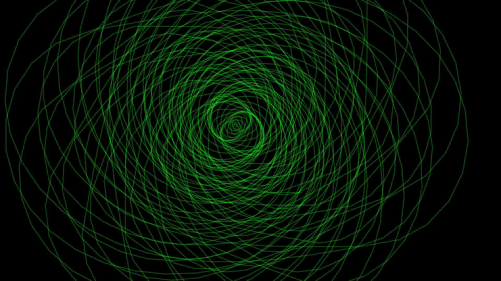
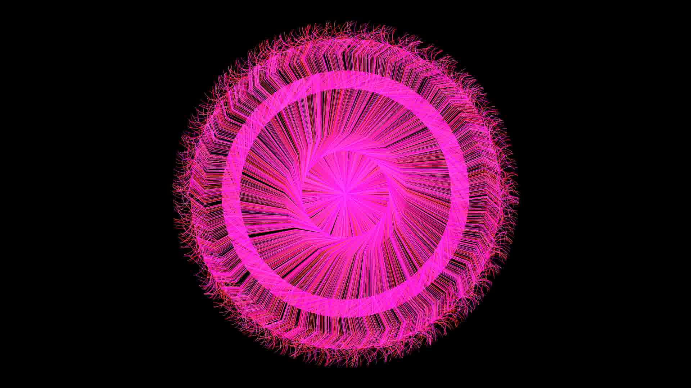
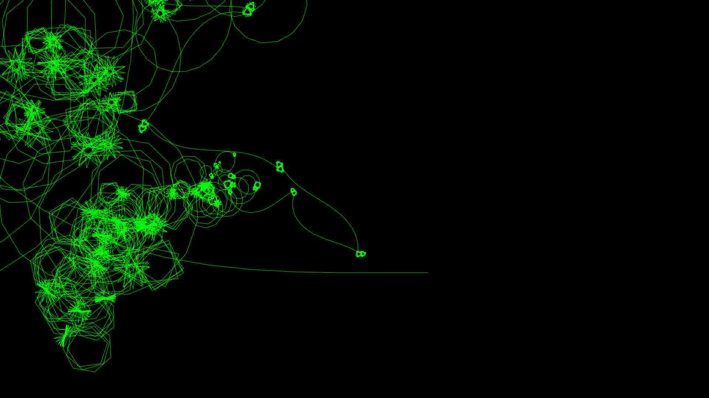
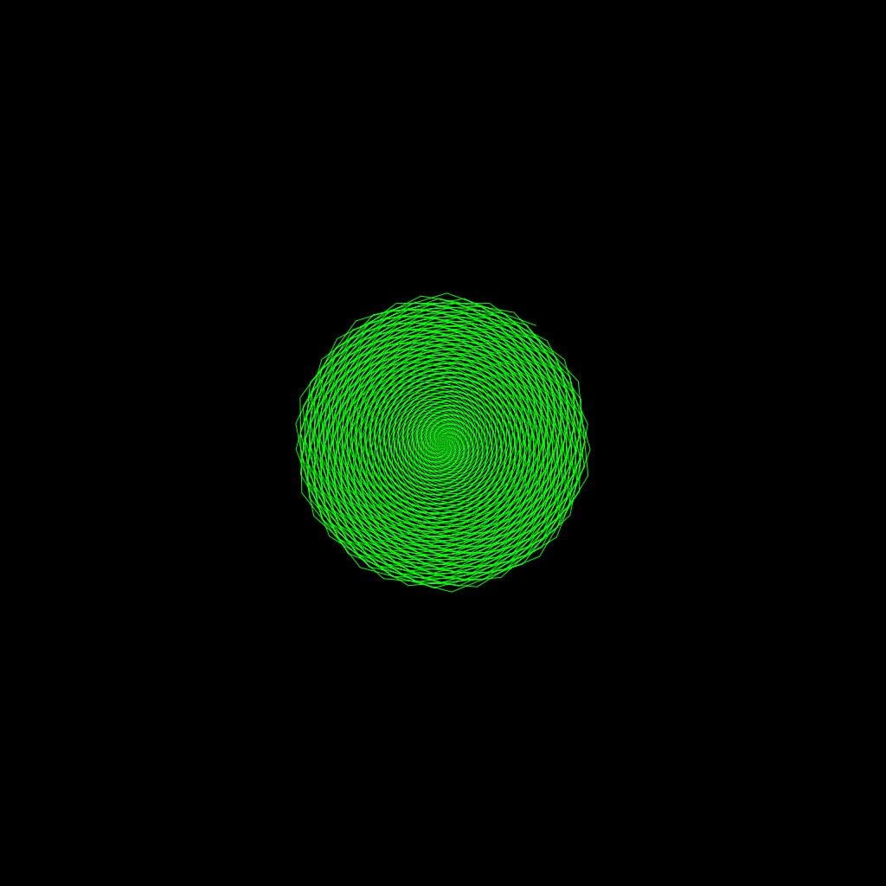

# logo-go
This is a just for fun experiment.

I was inspired to just write this when I was talking with a friend about visual programming languages his child was using to control lego builds.  
I remembered my early steps in front of a black screen with green letters on it.  
Beside "battleships" and "black-jack" game (and of course serious programs my father used for his job) there was a program called 'logo' and it was amazing.  
You could control that strange green triangle called "turtle" with simple command like "move forward 10 steps", "turn right for 30 degrees", "move forward 20 steps" and so if would draw a line on the screen.  
Having the additional power of loops you could easily create amazing artificial art drawings.

[Wikipedia: Logo Programming language](https://en.wikipedia.org/wiki/Logo_(programming_language))   

> the needle of the endless paper printer yelled through the house.

Being inspired by these memories I had to write this quick and dirty in my favorite language.
So this is not a rewrite of the original logo language, it is just an adoption in go.

After having the first version I was quickly bored and so decided to go one step beyond the original experience and
add an option the software will create not one image, but many.
So by having some parameter that will change with each frame I could create videos out of it.

## Artwork Gallery
Here's the artwork I added so far.
I decided to use random names as artwork identifiers instead of numbers.
The process of creating these artworks was quite random - I did not use mathematical functions, and I had no clue what would come out of the code.
  
**It was more like throwing a bucket of colour against the fabric.**

### Diesel Malone

* [Diesel Malone - small (1MB, MP4)](./out/DieselMalone.small.mp4)
* [Diesel Malone - large (44MB, MP4)](./out/DieselMalone.mp4)

### Malaika Kelly

* [Malaika Kelly - small (1MB, MP4)](./out/MalaikaKelly.small.mp4)
* [Malaika Kelly - large (24MB, MP4)](./out/MalaikaKelly.mp4)

### Danica Velez

* [Danica Velez - small (2MB, MP4)](./out/DanicaVelez.small.mp4)
* [Danica Velez - large (43MB, MP4)](./out/DanicaVelez.mp4)

### Chelsy Wagner
      
* [Chelsy Wagner - small (500KB, MP4)](./out/ChelsyWagner.small.mp4)
* [Chelsy Wagner - large (5MB, MP4)](./out/ChelsyWagner.mp4)

### Running the code
So if you like to run the code you should be an experienced software developer.  
If you are not, and you still want to try it, I give some hints:

* [install go](https://golang.org/doc/install)
* [install ffmpeg](https://github.com/adaptlearning/adapt_authoring/wiki/Installing-FFmpeg)
* in the projects root folder run `go run cmd/main.go`  
 (This will output the currently selected artwork.)
 
#### Add your own artwork
* read the code in **cmd/main.go** (starting at **func main**)
* add you artwork in **artWorks** variable
* artworks itself is in **arts/artworks.go**
